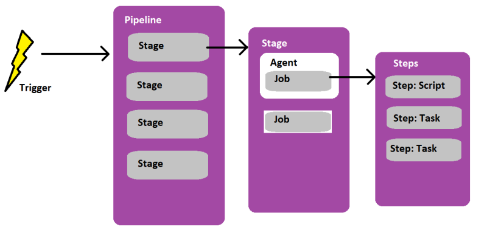

# Azuredevops
azuredevops woking dir
### Azure Devops Features
1. Boards
2. Repos
3. Pipelines
4. Test Plans
5. Artifactory
#### Boards
* This is used to Plan, Manage and Track Projects
* it will act as Project management tool like JIRA 
* it will have work items, Backlogs, Sprint, Delivery plans
#### Repos
* Here Devlopers will commit / coloborate code
* it will uses git as vcs and maintains the code in GitHub or BitBucket
#### Pipelines
* Here CI/CD pipelines are maintained
* here we have 2 types 
  * Build pipelines
  * Release pipelines
* It will have Environments, library, Task groups, Depoyment groups
#### Test Plans
* This manages test plans and test executions
#### Artifactory
* This service manages build artifacts
#### Extensions
* will add additional functionality in terms integrations, build and deploy by market place
#### Wiki and Dash boards
* All project documentations will shown in wiki 
* Dash boards for defects and scrum board
### Azure Devops config with GitHub and azure repos creation
### Pipeline creation by classic editor
### Pipelines by YAML syntax
* Azure pipeline Representaion

* Azure pipeline is collection of
  * **Stages**: Each stage is a collections of Jobs
  * **Jobs**: Each job is collections of steps
  * **Steps**: steps can be executed by `tasks` or `sctipt`(commands)
  * Here if we have only 1 stage we can directly write from jobs
  * if we have only 1 stage and 1 job we can directly write form steps
* [referhere][https://learn.microsoft.com/en-us/azure/devops/pipelines/yaml-schema/?view=azure-pipelines] for YAML Schema for pipelines.
* Azure devops pipeline syntax
```yaml
---
pool:
trigger:
stages:
  - stage:
    jobs:
      - job:
        steps:
          - task:
            # or
          - script:         
```
* In details with different options
```yaml
---
pool:
  name: "Azure Pipelines"      # if self hosted it is set as `Default`
  vmImage: "ubuntu-latest"     # this is only for microsoft hosted agent

trigger:
  - main                      # for Branch

parameters:
variables:
pr:                            # pull request
resources:                     # used when we create reusable templates                  
stages:
  - stage: 'Build_Stage'       # here we can use template and paramets also
    displayName: "Build Stage"
    dependsOn:                 # we can mention on which stage to be complted before this
    condition:
    variables:
    pool:
    jobs:
      - job: 'build_maven'
        displayName: 'building by maven tool'
        dependsOn: 
        condition:
        continueOnError:
        variables:
        pool:
        steps:
          - task:                # we have predefined tasks from azure devops
            inputs:
              displayName::
              # depends on particular task
            # or
          - script: # any script or command to execute
            workingDirectory:
            displayName:
```
* [referhere][https://learn.microsoft.com/en-us/azure/devops/pipelines/tasks/reference/?view=azure-pipelines&viewFallbackFrom=azure-devops] for azure devops tasks reference
#### pipeline for java application
```yaml
---
pool:
  name: "Default"

trigger:
  - main

parameters:
  - name: bucket_name
    displayName: bucket name
    type: string
    default: srikanthcicd
  - name: package_name
    displayName: package name
    type: string
    default: spring-petclinic-2.7.3.jar

stages:
  - stage: BuildStage
    displayName: CI
    jobs:
      - job: mavenjob
        displayName: maven
        steps:
          - task: Maven@3
            inputs:
              mavenPomFile: 'pom.xml'
              goals: 'package'
              publishJUnitResults: true
              testResultsFiles: '**/surefire-reports/TEST-*.xml'
              javaHomeOption: 'Path'
              jdkDirectory: /usr/lib/jvm/java-17-openjdk-amd64
              mavenVersionOption: 'Path'
              mavenDirectory: /opt/maven

          - script: aws s3 cp $(Build.SourcesDirectory)/target/spring-petclinic-2.7.3.jar s3://srikanthcicd --acl public-read-write
            displayName: uploading jar file to s3 

  - stage: RunStage
    displayName: CI
    jobs:
      - job: ansibleJob
        displayName: run through ansible 
        steps:
          - script: "ansible-playbook -i hosts spc.yaml"
            workingDirectory: /home/ubuntu
```
#### pipeline for dotnet 
```yaml
---
pool: default

trigger:
  - master

jobs:
  - job: Preparation_job
    displayName: install softwares
    steps:
      - task: DotNetCoreInstaller@1
        inputs:
          packageType: 'sdk'
          version: 6.x
  - job: Build_Job
    displayName: Build dotnet project
    dependsOn: Preparation_job
    condition: succeeded()
    steps:
      - task: DotNetCoreCLI@2
        inputs:
          command: 'build'
          projects: src/dotnet-demoapp.csproj
  - job: Test_Job
    displayName: Test dotnet
    dependsOn: Build_Job
    condition: succeeded()
    steps:
      - task: DotNetCoreCLI@2
        inputs:
          command: 'build'
          projects: tests/tests.csproj 
```
#### variables in pipelines
* allows us to create
  * create our custom variables
  * use predefined vaiables [referhere](https://learn.microsoft.com/en-us/azure/devops/pipelines/build/variables?view=azure-devops&tabs=yaml)
```yaml
---
pool:
  name: "Azure Pipelines" 
  vmImage: 'ubuntu-latest'

trigger:
  - main

steps:
  - task: Bash@3
    inputs:
      targetType: inline
      script: echo "Build Directory is $(Agent.BuildDirectory)"
  - task: Maven@3
    inputs:
      mavenPomFile: 'pom.xml'
      goals: 'package'
      publishJUnitResults: true
      testResultsFiles: '**/surefire-reports/TEST-*.xml'
      jdkVersionOption: '1.17'
```
#### Expressions
* Expressions can be used in many places, most common use in conditions and variables.
* can be evaluated at `compile time` and `run time`
* `compile time`: `${{ <expression> }}` can be used in parameters
* `run time`: `$[ <expression> ] can be used in variables
* [referhere](https://learn.microsoft.com/en-us/azure/devops/pipelines/process/expressions)
#### Functions
* we can use different functions in azure devops pipielines
* [refer here](https://learn.microsoft.com/en-us/azure/devops/pipelines/process/expressions)
* some of are `and`, `endsWith`, `eq`, `format`, `ge`, `gt`, `in`, `join`, `le`, `le` 
* `length`, `ne`, `not`, `or`, `replace`, `suceeded`
#### Azure Devops Templates
* by using templates we can azure devops pipeline as resusable 
* [refer here](https://learn.microsoft.com/en-us/azure/devops/pipelines/process/templates?view=azure-devops)
* to use templates we should first write reusable template with parameters
* and save that in github
* resuable template for dotnet for build
```yaml
# dotnet reusable template for dotnet projects
parameters:
  - name: 'command'
    displayName: command
    type: string
    default: 'build'
    values:
      - 'build'
      - 'push'
      - 'pack'
      - 'publish'
      - 'restore'
      - 'test'

  - name: projects
    displayName: "projects"
    type: string
    default: 'src/NopCommerce.sln'

  - name: 'publishWebProjects'
    displayName: "publish web projects"
    type: boolean
    default: 'true'
    values: 
      - 'false'

  - name: 'zipAfterPublish'
    displayName: "zip after pubish"
    type: boolean
    default: 'true'
    values: 
      - 'false'

  - name: 'artifactName'
    displayName: "artifact name"
    type: string
    default: 'srweb'
  
  - name: 'Buildconfiguration'
    displayName: " build configuration "
    type: string
    default: 'Release'
      
steps:
  - task: DotNetCoreCLI@2
    inputs:
      command: "${{ parameters.command }}"
      publishWebProjects: "${{ parameters.publishWebProjects }}"
      arguments: '--configuration $(Buildconfiguration) --output $(Build.ArtifactStagingDirectory)'
      zipAfterPublish: "${{ parameters.zipAfterPublish }}"
      packagesToPack: '**/*.csproj'
  - task: PublishPipelineArtifact@1
    inputs:
      targetPath: '$(Build.ArtifactStagingDirectory)'
      ArtifactName: "${{ parameters.artifactName }}"           
```
* reusable template for deploy
```yaml
# template for deploying to Azure App services 
parameters:
  - name: 'artifactName'
    displayName: "name of artifact"
    type: string
    default: 'srweb'
  - name: 'azureSubscription'
    displayName: "azure subscription"
    type: string
    default: 'srwebapp'
  - name: 'appName'
    displayName: "app name"
    type: string
    default: 'srapp'

steps:
  - task: DownloadPipelineArtifact@2
    inputs:
      artifactName: "${{ parameters.artifactName }}"
      downloadPath: '$(System.ArtifactsDirectory)/${{ parameters.artifactName }}'
    displayName: 'download package'
  - task: AzureWebApp@1
    inputs:
      azureSubscription: "${{ parameters.azureSubscription }}"
      appType: 'webAppLinux'
      appName: "${{ parameters.appName }}"
      package: '$(System.ArtifactsDirectory)/${{ parameters.artifactName }}/*.zip'
      deploymentMethod: 'auto'
```
* Now we have create original pipeline and we have call this template
* here we will use `resources` and `steps.template`
* Azure devops pipeline with using reusable template
```yaml
---
pool: 
  name: "Azure Pipelines"
  vmImage: 'ubuntu-latest'

trigger:
  - master

resources:
  repositories:
    - repository: Azuredevops
      endpoint: github.com_srikanthvelma
      name: srikanthvelma/Azuredevops
      type: github
      ref: 'refs/heads/main'

stages:
  - stage: Devlopment
    displayName: "Dev Environment"
    jobs:
      - job: buildNdpublish
        steps:
          - template: AzureDevopsReusableTemplates/dotnet/dotnet-reusable-template.yaml@Azuredevops
            parameters: 
              command: 'publish'
              ArtifactName: 'nopweb'
  - stage: Deploy
    displayName: "Deploy"
    jobs:
      - job: deploy
        steps:
          - template: AzureDevopsReusableTemplates/dotnet/dotnet-reusable-deploy-template.yaml@Azuredevops
```
* Instead of `resources` we can use `extends`, if the file availble with in same folder
#### Release pipelines
#### Azure Devops pipeloine -secrets
* use azure key vault store 


* try to figure out how to configure github and Azure repos