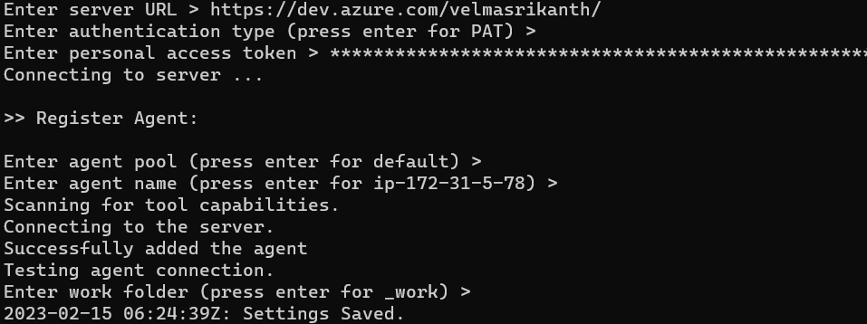
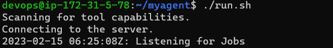
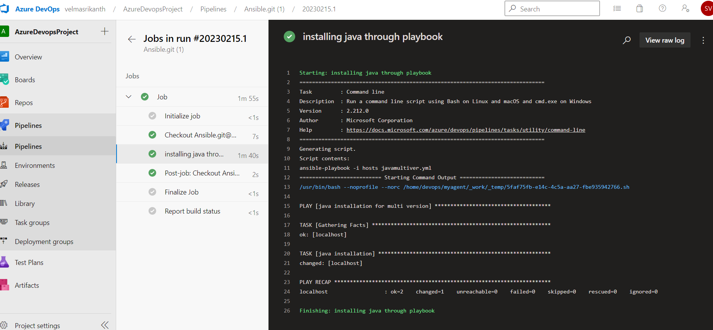
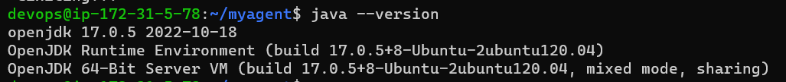

Write a pipeline for ansible playbook
-------------------------------------
1. config ACN as selfhosted agent
2. write a pipeline to run ansible-playbook command (steps.script with working dir)
3. execute pipeline in Azure devops

### config ACN as selfhosted agent
* create a vm (ubuntu 20.04) install ansible and config ssh key to local host
* so now ACN with localhost configured is ready
* next  to configure ACN as selfhosted agent
* goto azuredevops-agent pools - defualt - new agent - select linux -and follow
  ```
  wget https://vstsagentpackage.azureedge.net/agent/2.217.2/vsts-agent-linux-x64-2.217.2.tar.gz
  mkdir myagent && cd myagent
  sudo mv vsts-agent-linux-x64-2.217.2.tar.gz /myagent
  sudo tar zxvf vsts-agent-linux-x64-2.217.2.tar.gz
  ./config.sh
  ./run.sh
  ```



### write a pipeline to run ansible-playbook command
```yaml
---
pool:
  name: "Default"

trigger:
  - main

steps:
  - script: "ansible-playbook -i hosts javamultiver.yml"
    workingDirectory: ./Playbooks/java
    displayName: installing java through playbook
```
### execute pipeline in Azure devops


