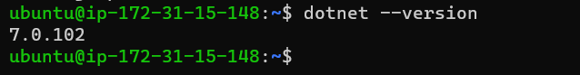

nopCommerce manual Package Build steps
-------------------------------------
Build
-----
* **Prerequisites**
1. dotnet 7.0 or more req 

* **STEPS**
* dotnet installation
```
sudo apt update
wget https://packages.microsoft.com/config/ubuntu/20.04/packages-microsoft-prod.deb -O packages-microsoft-prod.deb # for ubuntu20.04
sudo dpkg -i packages-microsoft-prod.deb
sudo apt-get update
sudo apt-get install -y dotnet-sdk-7.0
```

* Build package for nopcommerce
```
git clone https://github.com/nopSolutions/nopCommerce.git
dotnet build ~/nopCommerce/src
```
