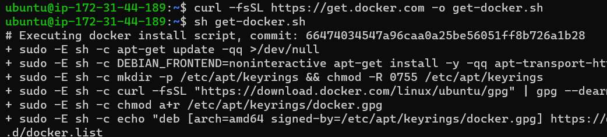
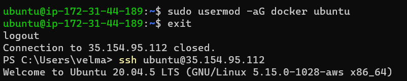
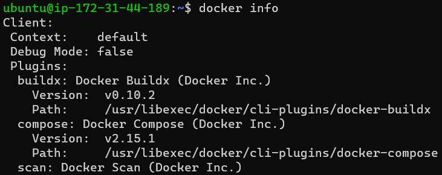
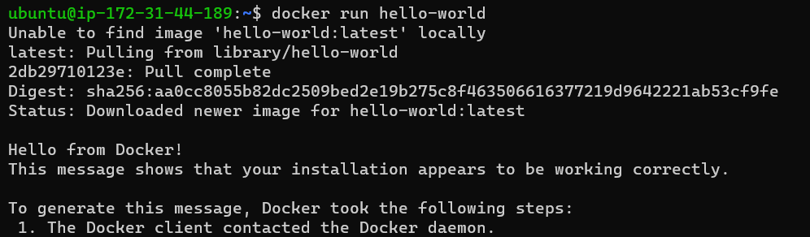
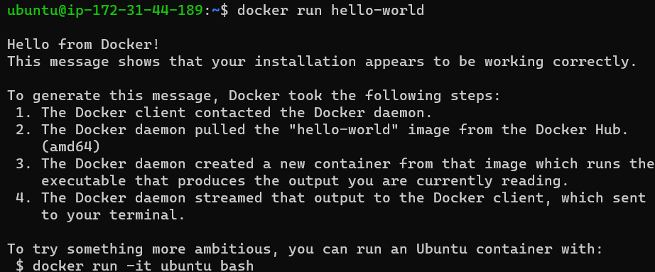
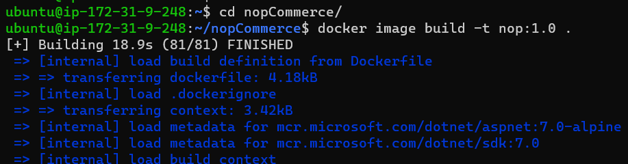
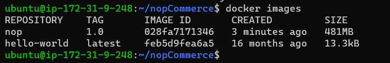

Manual steps to build docker image for nopCommerce
--------------------------------------------------
** required storage machine -16 gb storage and t2.large

1. **Install docker**

```
curl -fsSL https://get.docker.com -o get-docker.sh
sh get-docker.sh
sudo usermod -aG docker ubuntu   #( ubuntu is user name here)
```


```
#exit and relogin
docker info
# This command should not give any errors
docker run hello-world
```




2. **clone nopcommerce from git hub**
```
git clone https://github.com/nopSolutions/nopCommerce.git
cd nopCommerce
docker image build -t nop:1.0 .
```



