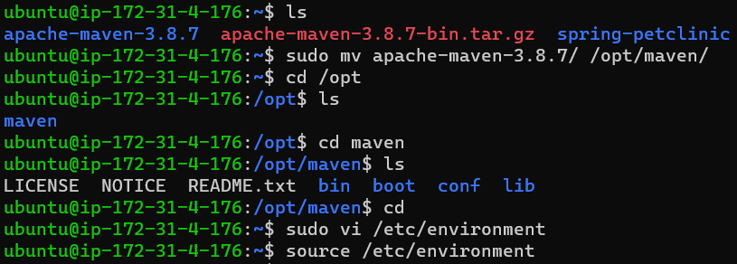
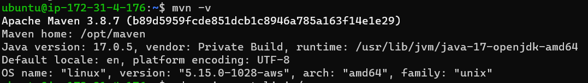
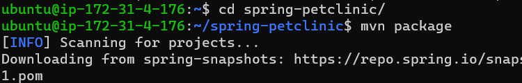
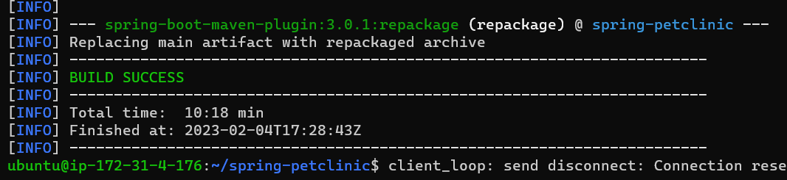

Manual steps for spring pet clinic for Build and Package
--------------------------------------------------------
### Minimum required softwares
1. java 17 
2. maven 3.8.3

* Create one ubuntu 20.04 instance
* install java through apt
* install maven through downloading tar file as apt installing maven 3.6 which is not suffiecient
* always refer spring pet clinic for latest version requirements of java and maven

### Steps
1. java installation
```
sudo apt update
sudo apt install openjdk-17-jdk -y
java --version
```
2. maven installation
* we can install maven directly from apt but it will install 3.6.3, by this build is not done so try to installing 3.8.7
```
wget https://dlcdn.apache.org/maven/maven-3/3.8.7/binaries/apache-maven-3.8.7-bin.tar.gz /tmp
sudo tar -zxvf apache-maven-3.8.7-bin.tar.gz
sudo mv apache-maven-3.8.7/ /opt/maven/
sudo vi /etc/environment  # add env variable as :opt/maven/bin
source /etc/environment
mvn -v
```




1. Spring pet clinic package
```
git clone https://github.com/spring-projects/spring-petclinic.git
cd spring-petclinic
mvn package
```



