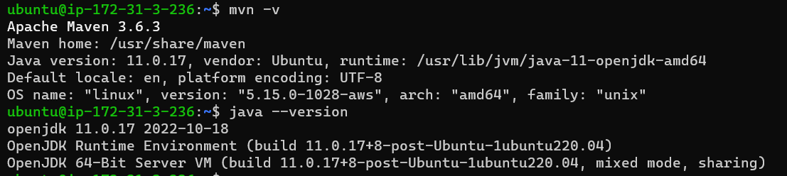
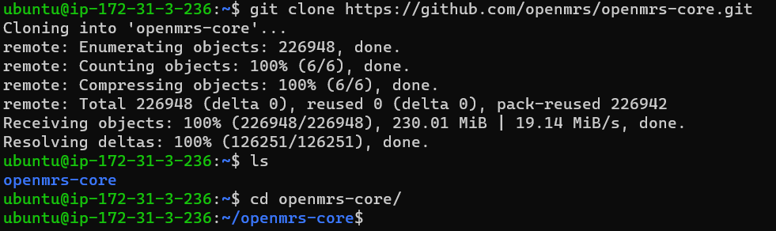
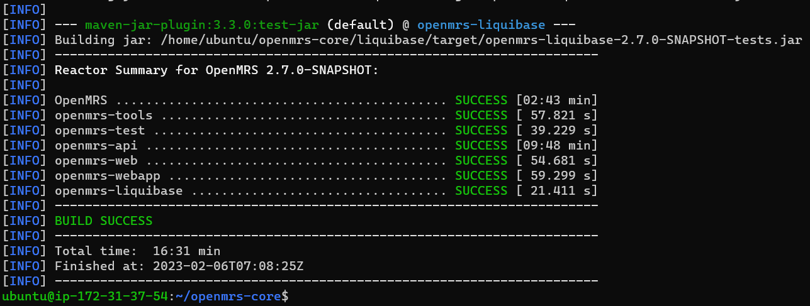
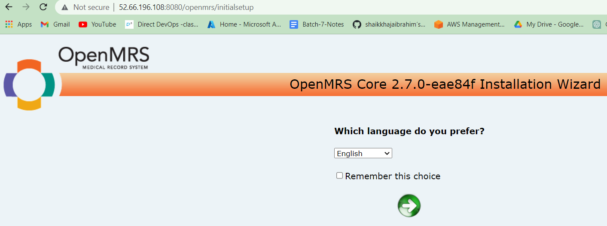

OpenMRS Manual Package Build steps
----------------------------------
Build
-----
* **Prerequisites**
1. java minimum 8 required
2. maven min 3 required
3. git - normally git will present , if not install git

* **steps**
```
sudo apt update
sudo apt install openjdk-11-jdk -y
sudo apt install maven -y
```


```
git clone https://github.com/openmrs/openmrs-core.git
cd openmrs-core
```

```
mvn package
```

```
cd openmrs-core/webapps
mvn jetty:run
```
